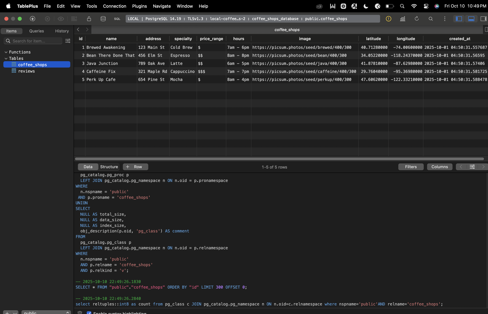
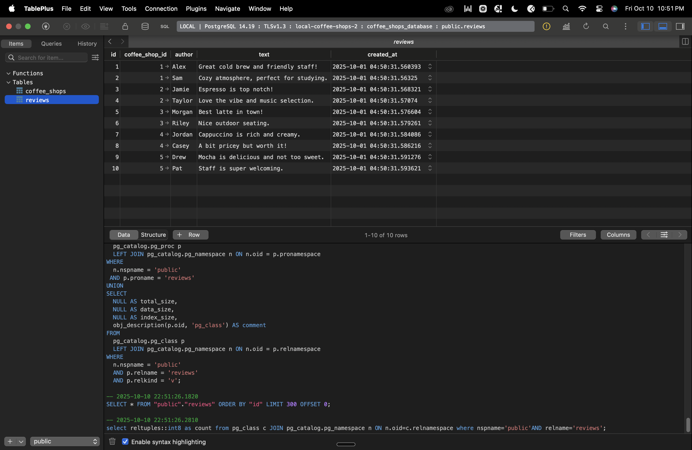

# ☕ Local Coffee Shops Guide - Part 2

**WEB103 - Project 2: Listicle Part 2**

Discover the best local coffee shops in the United States!  
Browse, click, and explore each shop's specialties, hours, and more.

**This version uses PostgreSQL database to serve data instead of JSON files.**

## 🌐 Live Demo
**Deployed Application**: [https://local-coffee-shops-2.onrender.com/](https://local-coffee-shops-2.onrender.com/)

## 📹 Project Demo


## 🎯 Project Requirements Met

**Total Score: 14/14 points (12 + 2 bonus)**

### Required Features (12 points):
- ✅ **HTML, CSS, JavaScript only** (2 points) - No frontend frameworks used
- ✅ **PostgreSQL Database** (10 points) - Data served from PostgreSQL via Render

### Stretch Features (2 bonus points):
- ✅ **Search by attribute** (2 points) - Users can search coffee shops by specialty


---

## 🚀 Features

### Required Features
- [x] **Vanilla HTML/CSS/JS** (no frameworks)
- [x] **PostgreSQL Database** - Data served from PostgreSQL instead of JSON
- [x] **Database Schema** - Properly structured tables for coffee shops and reviews
- [x] **Seeded Data** - Database populated with coffee shop data from original project

### Additional Features
- [x] **Express backend** serving static and dynamic routes
- [x] **RESTful API Endpoints** - Clean API structure for data fetching
- [x] **Organized Project Structure** - Separated client and server code
- [x] **Picocss styling** for a modern look
- [x] **Five+ unique coffee shops** with images and details
- [x] **Clickable cards** for detail views
- [x] **Custom 404 page**
- [x] **Responsive grid layout**
- [x] **Review system** - Users can add reviews to coffee shops

### Stretch Features
- [x] **Search by attribute** - Users can search/filter coffee shops by specialty

---

## 🏗️ Project Structure

```
local-coffee-shops-2/
├── client/                 # Frontend files
│   └── src/
│       ├── assets/
│       │   └── images/     # Images and static assets
│       ├── css/
│       │   └── style.css   # Styling
│       ├── index.html      # Main page
│       ├── script.js       # Frontend JavaScript
│       ├── about.html      # About page
│       └── 404.html        # 404 error page
├── server/                 # Backend files
│   ├── config/
│   │   ├── database.js     # Database connection
│   │   ├── setup-database.js # Database setup script
│   │   └── data/
│   │       └── coffeeshops.json # Original data for seeding
│   ├── routes/
│   │   └── coffeeshops.js  # Coffee shops API routes
│   └── server.js           # Main server file
├── .env                    # Environment variables
├── .gitignore             # Git ignore file
├── package.json           # Project dependencies
└── README.md              # This file
```

---

## 🗄️ Database Schema

### Coffee Shops Table
```sql
CREATE TABLE coffee_shops (
  id SERIAL PRIMARY KEY,
  name VARCHAR(255) NOT NULL,
  address VARCHAR(255) NOT NULL,
  specialty VARCHAR(255),
  price_range VARCHAR(10),
  hours VARCHAR(100),
  image VARCHAR(500),
  latitude DECIMAL(10, 8),
  longitude DECIMAL(11, 8),
  created_at TIMESTAMP DEFAULT CURRENT_TIMESTAMP
);
```

### Reviews Table
```sql
CREATE TABLE reviews (
  id SERIAL PRIMARY KEY,
  coffee_shop_id INTEGER REFERENCES coffee_shops(id) ON DELETE CASCADE,
  author VARCHAR(255) NOT NULL,
  text TEXT NOT NULL,
  created_at TIMESTAMP DEFAULT CURRENT_TIMESTAMP
);
```

---

## 🗄️ PostgreSQL Database Screenshots

These screenshots show the actual `coffee_shops` and `reviews` tables and data in the deployed PostgreSQL database:




---

## 📋 Installation & Setup

### Prerequisites
- Node.js (v14 or higher)
- PostgreSQL (v12 or higher)
- npm

### Step 1: Clone the Repository
```bash
git clone <your-repo-url>
cd local-coffee-shops-2
```

### Step 2: Install Dependencies
```bash
npm install
```

### Step 3: Database Setup
1. **Create PostgreSQL Database:**
   ```bash
   createdb local_coffee_shops
   ```

2. **Configure Environment Variables:**
   Update the `.env` file with your database credentials:
   ```env
   DATABASE_URL=postgresql://localhost:5432/local_coffee_shops
   DB_HOST=localhost
   DB_PORT=5432
   DB_NAME=local_coffee_shops
   DB_USER=postgres
   DB_PASSWORD=your_password_here
   PORT=3000
   ```

3. **Initialize Database Tables and Data:**
   ```bash
   npm run setup-db
   ```

### Step 4: Start the Server
```bash
npm start
```

### Step 5: View the Application
Open your browser and navigate to: `http://localhost:3000`

---

## 🛠️ API Endpoints

### GET `/api/coffeeshops`
Returns all coffee shops with their reviews

### GET `/api/coffeeshops/:shopname`
Returns a specific coffee shop by name

### POST `/api/coffeeshops/:shopname/reviews`
Adds a new review to a coffee shop

---

## 🎯 Key Changes from Part 1

1. **Database Integration:** Replaced JSON file storage with PostgreSQL database
2. **Structured Architecture:** Separated client and server code into organized folders
3. **RESTful API:** Created proper API endpoints for data access
4. **Database Schema:** Designed normalized tables for coffee shops and reviews
5. **Environment Configuration:** Added environment variables for database connection
6. **Setup Scripts:** Automated database initialization and seeding

---

## 📚 Technologies Used

- **Frontend:** HTML5, CSS3, JavaScript (ES6+), PicoCSS
- **Backend:** Node.js, Express.js
- **Database:** PostgreSQL
- **Deployment:** Render.com
- **Environment:** dotenv for configuration
- **Database Driver:** node-postgres (pg)

---

## 🚀 Deployment

**Live Application**: [https://local-coffee-shops-2.onrender.com/](https://local-coffee-shops-2.onrender.com/)

### Deployment Details:
- **Platform**: Render.com
- **Database**: PostgreSQL (Render managed)
- **Environment**: Production
- **Auto-deploy**: Connected to GitHub repository

### Features Verified in Production:
- ✅ Database connection and data loading
- ✅ API endpoints functioning correctly
- ✅ Search and filtering capabilities
- ✅ Responsive design across devices
- ✅ Coffee shop detail pages
- ✅ Review system functionality

---

## ✨ Acknowledgments

- Coffee shop data and images are for demonstration purposes
- Built as part of WEB103 - Intermediate Web Development course
- Uses PicoCSS for modern, responsive styling
